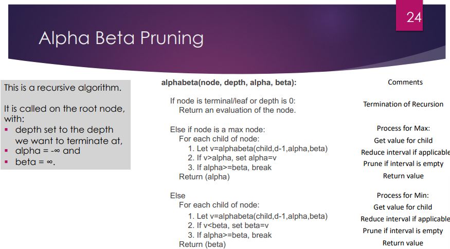

# Introduction
### what is AI
- think like people
- think rationally
- act like people
- act rationally
### def of AI
- The simulation of human-like intelligence in machines     that are programmed to think like humans and mimic their actions.
- Any machine or software that exhibits traits associated with a human mind such as learning and problem-solving.
### Turing test
- Goal: test maschine to exhibit intelligence near that of a human
- human evaluator

# Search
### Shortest path problems
- Finding a route that minimizes some cost (distance, time, money, etc)
### best first serch
- explore "promising" node first according to rule
### greedy search
- expand node that you think is closest to goal
### A star
- f = g + h; f:cost function, g:cost of edge; h:heuristic
- heuristic has to be optimal and monotonic

### Things to think about
- What is a search problem?

A search problem is a problem which requires the agent to find a path from a starting node to a given goal node.
- How can we compare breadth-first serach with A*?

Breadth first search explores the states on a first in - first out bases. This way the search space is uniformly explored. With A* search, the search space is explored in a more directed way because A* has a heuristic that (should) indicate the right directions.
- What are the properties of a heuristic?

A heuristic should be optimal (admissive), meaning that it estimates the path to the goal to be lower than it really is. It should also be consistent, meaning that the expected cost to the goal should always decrease the closer you get to the goal.

# competitive search
### zero sum games
- agents have opposite utilities
- pure competion (one max, one min)
- two players
- turn taking
- perfect information
- deterministic
### minimax search

- time: O(b^m)
- space: O(b^m)
- b is game trees branching factor and m is maximum depth
### resource limits
- bounded lookahead
    - to some depth
### game tree pruning

- can suffer from low depth
- postpone bad events
- $\alpha$-$\beta$ pruning
    - $\alpha$ = best option max player
    - $\beta$ = best option min player

### Things to think about
- What are advantages of $\alpha$-$\beta$ pruning over minimax?

With $\alpha$-$\beta$ pruning you reduce the search space by disregarding certain branches that you won't visit anyway. Th
ekam s

# planning
### planning
- what to do in what order
### PDDL planning domain defintion language
- states
    - true or false statements
    - atomic
- actions 
    - preconditions
    - effect
- goals
    - conjunction of literals
### forward state space search
- best first search
- backtrack path/s
### backward search
- start with goal and apply actions backwards unitl start is reached
- hard for good heuristics

# scheduling
### scheduling
- when to do the action
- actions have: duration, consume resources, uses resources
- goal: optimal schedule for the performance (shortest or minimal)
- actions can be done in parrallel
- critical path is where slack is 0 (LS-ES)
### priority based scheduling with resource constraints
- select highest prio action from whose predecssors have had their T scheduled
- min slack

- resource contstraints make it NP hard
- not always optimal
- others approaches: SAT, local search

# prob bays
### fequentist
- If you repeat an experiment enough times then the probability tells you something about the number of outcomes. If I toss a coin 1000 time then I expect around 500 heads and 500 tails.
### Subjectivist
- Some how the probability measures your subjective belief in a statement. The axioms of probability gives you constitutions for logically consistent beliefs.
### bayes theorem
$P(A|B) = \dfrac{P(A)P(B|A)}{P(B)}$
posterior = $\dfrac{prior x likelihood}{evidence}$

# prob bays markow
### bayesian network
- given some observed data how do I compute the conditional prob or how do I estimate prob of the rest of the distribution
### markov chains
- foward prob calculations
- there are states which have a probability distribution
- only depended on the previous state
- Questions:
    - give probs what is the likely sequence of states
    - in which state I will end up
    - what is the likely state of hidden states
### Hidden markov model
- observations
- hidden states
- Questions:
    - what prob that I am in some state (forward prob)
    - what is the likely sequence of internal (hidden) state given the observation
### smoothing
- recalculate the probs given that you know which state you arrived in
### viterbis algorithm
- find the sequence of hidden states given the observations

# Ethics and Law
### Ethics Law
- $Ethics \neq Law$
- Law is framewotk where ethical behavious is encouraged
### why should we care ehtic
- cause you desing important software (autopilot)
### why should we care about philosphy
- what is right or wrong?
- list of rules?
### deontological ethics/ rights
- focusing on universal rrights
- human rights, upholding personhood
### teloological ehticas / goods,harms
- goods that oughts to be pursued
- maximize benefits
- minimize harms
### virtue / aretaic ethics
- focus on virtue of actors
- good virtues : honesty,self-control
### ACM
- contribute to society and human well being
### EU AI ACT
- Unacceptable Risk Systems will be Prohibited. Includes social scoring, real-time remote biometric identification in public spaces such as facial recognition.
- High Risks Systems will be Carefully Regulated. Includes biometrics,
critical infrastructure, Education, Law enforcement, recruitment,
financial services.
- Limited and Minimal Risk Systems. Everything else, but still subject to transparency obligations.
### guideline for AI
- lawful
- ethical
- robust
### framework for AI
1. Human Agency and Oversight
2. Technical Robustness and Safety
3. Privacy and Data Governance
4. Transparency
5. Diversity, Non-discrimination and Fairness
6. Environmental and Societal Well-Being
7. Accountability
### accuracy
- low level accuracy of AI result in consequences
- AI uptodate?
### explainability
- are AI decisions explainable
- also for the user

# learning from nature
### artifical neural networks
- based on biological model(neurons)
- back propagatiion for training
- store information in weights
### deep learning
- networks with hidden layers
- more layers more abstraction
### reinforcement learning RL
- reward: evalutating the output of the agent
- goal: make decisions that maximise the reward
- agent explores (maybe sub-optimal at times)
- trial and error 
- Problems:
    - board games
    - robots
### evolutionary computing (EC)
- kinda same as RL but method is different
- method inspired by genetics, natural selection
- filter out bad ones
- applications:
    - racing games
    - neural networks
    - scheduling
### swarm intelligence
- inspired by social animals
- no leader
- local interaction
- local rules
- applications:
    - movies, graphics

# Think about Questions
## Search
### What is a search problem?
The objective in a search problem is to find a path from the initial state to the goal state that minimizes the path cost, if applicable.
### How can we compare breadth-first search and A* search?

### What are the proprieties of a heuristic?
- Admissibility ensures the solution is optimal.
- Consistency helps ensure both optimality and efficiency.
- Accuracy and Efficiency balance trade-offs between heuristic computation time and search performance.

## competitive search
### What are the advantages of alpha-beta pruning over minimax?
Alpha-beta pruning is an optimization technique for the Minimax algorithm used in adversarial games (like chess and checkers). It cuts off branches in the game tree that are guaranteed not to influence the final decision, thereby reducing the number of nodes evaluated.
### What are some examples in which machines can beat humans for different games?
chess, checkers
### What is the importance of adversarial games, and what are the practical applications?
Strategic decision-making against an oppenent.
Autonomous systems; Cybersecurity: Adversarial techniques are used in cybersecurity to develop AI that can anticipate and counter cyberattacks

## planning and scheduling
### What makes a problem a "planning problem"?
A planning problem is a type of computational problem where the goal is to find a sequence of actions (a plan) that transforms an initial state into a goal state.
### What should you keep in mind when defining actions?
Preconditions, Effects
### What are the limitations of PDDL?
- only for deterministic domains, not for continious variables

## bayes
### What is uncertainty? What are the main sources of uncertainty?
Uncertainty refers to situations where the outcome of a decision or event is not known with certaint
### What is probability? How do I use Bayes' theorem?
Probability is a mathematical framework used to quantify uncertainty. It is a measure of how likely an event is to occur.
Bayes' theorem allows the doctor to update the belief about the patient’s disease status based on the test result.
### What are Random Variables? How can one variable be dependent on another?
A random variable is a variable that can take on different values based on the outcomes of a random process. Each possible value is associated with a certain probability, and the random variable captures the uncertainty in the outcomes.
wo variables are said to be dependent when the outcome of one influences the probability distribution of the other. P(A|B)
### The definition of a Bayesian network and how it relates to conditional probabilities..
A Bayesian Network (also called a Bayes net or belief network) is a graphical model that represents the probabilistic relationships among a set of random variables. It uses a directed acyclic graph
Each node has an associated conditional probability distribution (CPD) that quantifies the effect of the parent nodes (direct influencers) on the node itself

## bayes2
### When is it appropriate to use Bayesian Networks?
Bayesian Networks are appropriate in situations where you need to model the probabilistic relationships between variables and infer the likelihood of certain outcomes based on partial or uncertain information.
### What are the main sources of uncertainty in an expert system?
Incomplete Knowledge, Measurement noise
### What is the Markov assumption? 
The Markov Assumption simplifies complex systems by stating that the future state of a system depends only on the present state, not on the full history of past states
### How do I calculate the forward probabilities in a Markov mode?
Forward probabilities in a Markov model are calculated using a forward algorithm that computes the probability of a sequence of observations given a hidden Markov model (HMM).
### When can I use Markov models?
Weather Prediction, Speech recognition, Bioinformatics

## HMM
### When should you use (or not) the different algorithms? (forward, backwards, etc...)
The forward algorithm computes the probability of observing a sequence of observations up to a certain time step, considering all possible states the system might be in. It is used to calculate the likelihood of a given observation sequence in an HMM.
The backward algorithm is used to compute the probability of seeing the future observations, starting from a given time step and considering all possible future states. It is essentially the reverse of the forward algorithm, looking ahead from a specific point in time rather than looking at past observations.
The Viterbi algorithm is used to compute the most likely sequence of hidden states

## Laws and ethics
### Can algorithms be fair and unbiased?  
Algorithms—particularly those used in machine learning and artificial intelligence—are not inherently fair or unbiased. Whether they are fair or biased depends on various factors, including the data they are trained on, how they are designed, and how they are applied
### Laws vs ethical behaviour 
When discussing technology and algorithms, it's important to distinguish between laws (which are legally enforced rules) and ethical behavior (which involves moral principles guiding right and wrong).